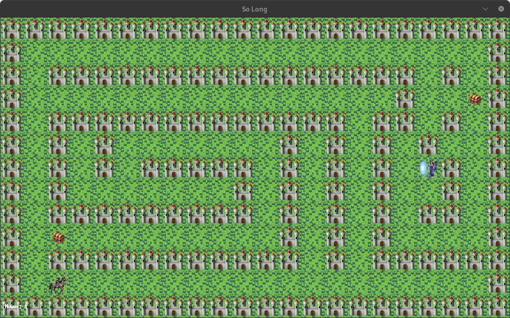
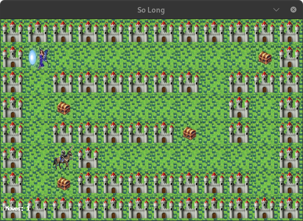
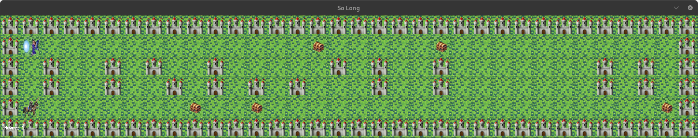

# 🎮 So Long - A Simple 2D Adventure Game


<h1 align="center"> so_long - @42Prague </h1>

<p align="center">:information_source: A small 2D Game made using the MiniLibX Graphics Library - Textures, sprites and tiles included. </p>
<p align="center"><a href="https://www.42.fr/" target="_blank"></a></p>

<!-- Your game screenshot -->
<p align="center"> </p>
<p align="center">123/100 :white_check_mark:</p>

<p align="center">:magic_wand: Collect all treasures and escape through the exit!</p>

## Index
* [What is So Long?](#-what-is-so-long)
* [Game Objective](#-game-objective)
* [How to Play](#️-how-to-play)
* [Quick Start Guide](#-quick-start-guide-for-everyone)
* [Technical Details](#️-technical-details-for-developers)
* [Game Features](#-game-features)
* [Screenshots](#-game-screenshots)
* [Project Structure](#-project-structure)
* [42 School](#-42-school)
* [Author](#-author)

## 📖 What is So Long?

**So Long** is a simple 2D adventure game where you control a character who needs to collect all coins scattered throughout a maze and then escape through the exit. It's like a digital treasure hunt! 

This project is part of the 42 School curriculum, focusing on:
- **Graphics programming** with MiniLibX
- **Memory management** and leak prevention
- **Event handling** for keyboard input and window events
- **Map validation** ensuring proper game structure
- **Game logic** implementation with win conditions

Think of it as a classic arcade-style game similar to Pac-Man, but instead of eating dots, you're collecting coins to unlock your way out.

## 🎯 Game Objective

- **Your Mission**: Navigate through the maze and collect ALL coins (💰)
- **Victory Condition**: After collecting all coins, reach the exit door (🚪)
- **Challenge**: Find the most efficient path while avoiding dead ends!

## 🕹️ How to Play

### Game Controls
- **W** or **↑** - Move Up
- **A** or **←** - Move Left  
- **S** or **↓** - Move Down
- **D** or **→** - Move Right
- **ESC** - Quit the game

### Game Elements
| Symbol | Element | Description |
|--------|---------|-------------|
| **P** (👤) | Player | That's you! |
| **C** (💰) | Collectible | Coins to collect |
| **E** (🚪) | Exit | Door (opens after collecting all coins) |
| **1** (🧱) | Wall | Impassable barriers |
| **0** (⬜) | Empty space | Safe to walk on |

## 🚀 Quick Start Guide (For Everyone!)

### Prerequisites
```bash
# Install required dependencies (Ubuntu/Debian)
sudo apt-get update
sudo apt-get install gcc make libx11-dev libxext-dev libxrandr-dev libbsd-dev
```

### Installation & Running
```bash
# 1. Clone the repository
git clone https://github.com/yourusername/so_long.git
cd so_long

# 2. Compile the project
make

# 3. Run the game with a map
./so_long src/maps/mandatory/valid_maps/map1.ber
```

### Available Maps
- `map1.ber` - Beginner friendly (5x3)
- `map2.ber` - Small challenge (8x6)
- `map3.ber` - Medium difficulty (12x8)
- `map4.ber` - Getting tricky (15x10)
- `map5.ber` - Advanced (20x13)
- `map6.ber` - Expert level (25x15)
- `map7.ber` - Master challenge (30x18)
- `map8.ber` - Ultimate test (35x20)

## 🛠️ Technical Details (For Developers)

### Project Requirements (42 Norm Compliance)
- Maximum 25 lines per function
- Maximum 80 characters per line
- Maximum 4 parameters per function
- Maximum 5 variables per function
- No forbidden functions: `for`, `do-while`, `switch`, `goto`, ternary operators

### Build System
```bash
make          # Compile the game
make clean    # Remove object files
make fclean   # Remove all generated files
make re       # Rebuild everything from scratch
make bonus    # Compile with bonus features
```

### Map Validation Rules
- Must be `.ber` extension
- Rectangular shape (all rows same length)
- Surrounded by walls ('1')
- Exactly one player ('P') and one exit ('E')
- At least one collectible ('C')
- Valid path from player to all collectibles and exit

## 🏆 Game Features

✅ **Core Features**
- Multiple difficulty levels (8 maps)
- Smooth player movement with collision detection
- Real-time move counter
- Win/lose condition handling
- Proper memory management (no leaks)

✅ **Graphics**
- Custom pixel-art sprites
- Clean, retro-style visuals
- Responsive window management
- Cross-platform compatibility (Linux/macOS)

✅ **Input Handling**
- WASD and arrow key support
- ESC key for clean exit
- Window close button handling

## 📸 Game Screenshots

<!-- Add your actual screenshots here -->
<div align="center">
  
  <br>
  
  <br>
  <em>Different levels showing increasing complexity</em>
</div>

<!-- If you have animated GIFs -->
<div align="center">
  
  <br>
  <em>Live gameplay demonstration</em>
</div>

## 📁 Project Structure

```
so_long/
├── src/                    # Source code
│   ├── main.c             # Entry point
│   ├── window.c           # Graphics handling
│   ├── player.c           # Player movement
│   ├── checking*.c        # Map validation
│   ├── passability.c      # Path finding
│   └── maps/              # Game maps
│       ├── mandatory/     # Required maps
│       └── bonus/         # Additional maps
├── images/                 # Screenshots and assets
├── libft/                 # Custom C library
├── ft_printf/            # Custom printf
├── minilibx/             # Graphics library
├── Makefile              # Build configuration
└── so_long.h             # Header file
```

## 🐛 Troubleshooting

### Common Issues & Solutions

**"MLX library not found":**
```bash
# Install MLX dependencies
sudo apt-get install libx11-dev libxext-dev libxrandr-dev
```

**"Permission denied":**
```bash
chmod +x so_long
```

**"Map error - not closed by walls":**
- Ensure your map is completely surrounded by '1' characters
- Check for any missing walls in corners

**Memory leaks detected:**
```bash
# Run with Valgrind to check
valgrind --leak-check=full ./so_long map.ber
```

## 🎓 42 School

This project is part of the 42 School curriculum - a revolutionary coding school that:
- Uses **peer-to-peer learning** (no teachers!)
- Focuses on **project-based learning**
- Is completely **free and open to all**
- Has campuses worldwide including **42 Prague**

Learn more: [42.fr](https://www.42.fr/) | [42 Prague](https://www.42prague.com/)

## 👨‍💻 Author

<div align="center">
  <h3>olcherno | 42Prague Student 🚀</h3>
  <p><em>Passionate about systems programming and game development</em></p>
  
  <!-- Add your contact links here -->
  <a href="https://github.com/olcherno">
    
  </a>
  <a href="https://www.linkedin.com/in/yourprofile/">
    
  </a>
  <a href="mailto:your.email@example.com">
    
  </a>
</div>

## 📄 License

This project is created for educational purposes as part of the 42 School curriculum.

---

<div align="center">
  <h3>🎮 Ready to play? Follow the Quick Start Guide and begin your adventure! 🎮</h3>
  <p><em>Need help? Don't hesitate to reach out - gaming should be fun, not frustrating!</em></p>
</div>
