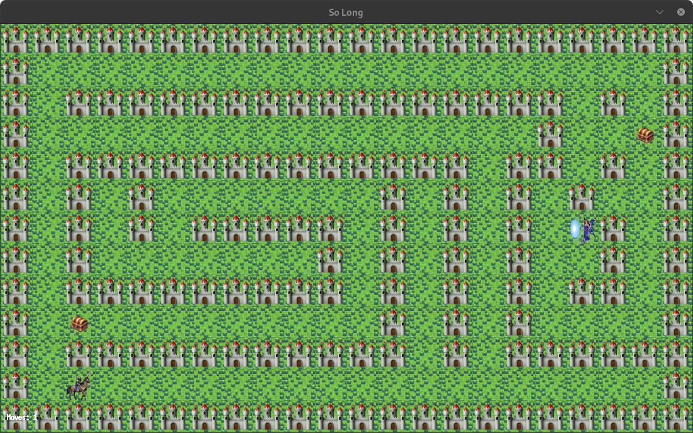

<h1 align="center"> so_long - 2D Adventure Game </h1>

<p align="center">:information_source: A small 2D Game made using the MiniLibX Graphics Library - Textures, sprites and tiles included. </p>
<p align="center"><a href="https://www.42.fr/" target="_blank"></a></p>
<p align="center"> </p>
<p align="center">Grade: 100/100 :white_check_mark:</p>

<p align="center">:magic_wand: Collect all treasures and escape through the exit!</p>

## Index
* [What is so_long?](#what-is-so_long)
* [Requirements](#requirements)
* [How does it work?](#how-does-it-work)
    * [Maps](#maps)	
    * [Controls](#controls)
* [Installation](#installation)
* [Usage](#usage)
* [Features](#features)
* [42 School](#42-school)
* [Author](#author)

<h2 align="center" id="what-is-so_long"> What is so_long? </h2>

So_long is a 2D top-down adventure game developed as part of the 42 School curriculum. It's built from scratch using the MiniLibX graphics library and focuses on:

- **Map validation** - Ensuring proper game map structure
- **Memory management** - Preventing memory leaks
- **Event handling** - Managing keyboard input and window events  
- **Graphics rendering** - Displaying sprites, textures, and animations
- **Game logic** - Player movement, collectibles, and win conditions

<h2 align="center" id="requirements"> Requirements </h2>

<p align="center"> :warning: The project must be written in accordance with the <a href="https://github.com/42School/norminette/blob/master/pdf/en.norm.pdf" target="_blank">Norm</a> </p>

**42 Norm Requirements:**
- Each function must be maximum 25 lines
- Each line must be at most 80 columns wide
- Maximum 4 named parameters per function
- Maximum 5 variables per function
- Forbidden: `for`, `do...while`, `switch`, `case`, `goto`, ternary operators, VLAs

**System Requirements:**
- Linux or macOS
- GCC compiler
- MiniLibX graphics library
- Make

<h2 align="center" id="how-does-it-work"> How does it work? </h2>

<h3 id="installation" align="center"> Installation </h3>

1. **Clone the repository:**
   ```bash
   git clone https://github.com/yourusername/so_long.git
   cd so_long
   ```

2. **Install MiniLibX (if not already installed):**
   ```bash
   # For Ubuntu/Debian
   sudo apt-get install libxext-dev libxrandr-dev libx11-dev libbsd-dev libssl-dev
   ```

3. **Compile the project:**
   ```bash
   make
   ```

<h3 id="usage" align="center"> Usage </h3>

Run the game with a map file:
```bash
./so_long maps/map1.ber
```

<h3 id="maps" align="center"> Maps </h3>   

Maps must be `.ber` files containing only these characters:

| CHAR | OBJECT |
|------|--------|
| 1 | Wall |
| 0 | Empty space |
| C | Collectible |
| E | Exit |
| P | Player start position |

**Map Rules:**
- Must be rectangular
- Surrounded by walls ('1')
- Contains exactly one player ('P') and one exit ('E')
- Contains at least one collectible ('C')
- Must have a valid path from player to all collectibles and exit

**Example Map:**
```
1111111111111
1P0000000C001
1000011111001
1000000000001
100000000000E1
1111111111111
```

<h3 id="controls" align="center"> Controls </h3>   

| KEY | ACTION |
|-----|--------|
| W or ⬆️ | Move up |
| A or ⬅️ | Move left |
| S or ⬇️ | Move down |
| D or ➡️ | Move right |
| ESC or Q | Quit game |

<h2 align="center" id="features"> Features </h2>

✅ **Map Validation**
- Checks for valid map format and structure
- Ensures all collectibles and exit are reachable

✅ **Movement System**
- Smooth player movement with collision detection
- Move counter display

✅ **Game Logic**
- Collect all items before accessing the exit
- Win/lose conditions

✅ **Graphics**
- Custom sprites and textures
- Proper window management

✅ **Memory Management**
- No memory leaks
- Proper cleanup on exit

<h2 align="center" id="42-school"> 42 School </h2>

42 is a global education initiative that offers a new way of learning technology:
- **Peer-to-peer learning** - No teachers, students learn from each other
- **Project-based** - Learning through hands-on coding projects  
- **Free and open** - No tuition fees, open to all
- **Merit-based admission** - Selection through intensive coding bootcamp (Piscine)

Learn more at: [42.fr](https://www.42.fr/)

<h2 align="center" id="author">Author</h2>

<div align="center">
    <div>
        <strong>Your Name | your_login | 🚀</strong>
        <br>
        <em>42 School Student</em>
    </div>
    <br>
    <div>
        :wave: Connect with me:
    </div>
    <div>
        <a href="https://www.linkedin.com/in/yourprofile/" target="_blank">
            
        </a>
        <a href="https://github.com/yourusername" target="_blank">
            
        </a>
        <a href="mailto:your.email@example.com">
            
        </a>
    </div>
</div>
